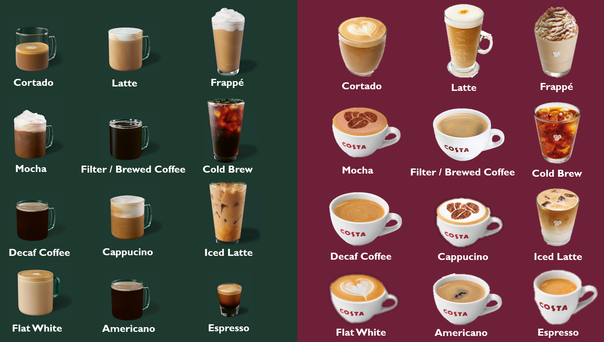
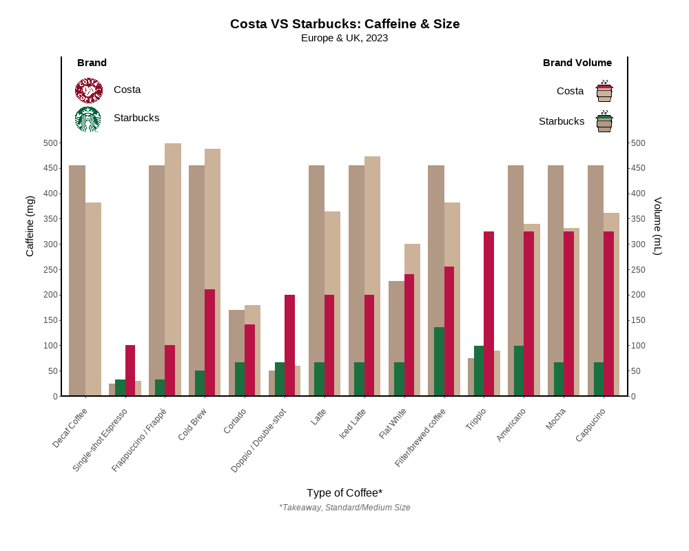

<center> 
# **STARBUCKS  &  COSTA COFFEE** 
</center>


#enable github pages (a single clickable link which displays the markdown pages)
#code rationale clearly and surcinctly explained

## **Background**
  
### Data Origins
Answering questions of where it comes from, how it was collected, what the variables mean, etc
show the first few rows of the raw data, if possible  
data source fully acknowledged, including details on data collection which are relevant to intepretation
  full permanent citation

### Project Organization

The /data folder contains data required for the project, and /images contains images required for the project, as well as visualization outputs.

A codebook describing all labels and abbrevations used in this project for data, variables, functions etc. within this project is located at /codebook.xlsx.
        
### **Research Questions**
in plain English, a simple statement of what question(s) your visualisation will attempt to address  

## **Data Preparation**
### Loading packages

The project utilized the renv package to retain package versions, safeguarding it from potential updates to packages in the future.

Package versions used in this project are listed within the file /renv.lock

```{r loadlib, echo = TRUE, results = 'hide', warning = FALSE, message = FALSE}
#Load packages with renv
install.packages("renv")
library(renv)
renv::restore()

#Import packages
library(tidyverse)
library(gapminder)
library(ggplot2)
library(png)
library(RCurl)
library(grid)
library(dplyr)
library(scales)
library(showtext)
library(here)  
library(readxl)
library(knitr)
library(kableExtra)
library(readr)
```

## Cleaning the data
steps taken to clean the data, exclude outliers, create summary statistics, grouped variables, etc
show the first few rows of the processed data, if possible
showing the code which does this where relevant  

```{r import icons}
#Specify image relative paths for logos and legend icons
Starbucks_image <- readPNG((here::here("images", "starbucks_logo.png")), 
                            native = TRUE)
Costa_image <- readPNG((here::here("images", "costa_logo.png")), 
                        native = TRUE)  

starbucks_cup <- readPNG((here::here("images", "starbucks_cup.png")), 
                          native = TRUE)
costa_cup <- readPNG((here::here("images", "costa_cup.png")), 
                      native = TRUE)  
```
```{r import data}
#Read raw data
rawdata <- read_excel(here::here("data","DAAVDATA.xlsx"))
kable(rawdata, format = "markdown")
``` 

```{r wrangle}
#Create clean dataframe
cleandata <- data.frame(
  Type.of.Coffee = c(rep(rawdata$'Type of coffee', 2)),
  Brand = rep(c("Starbucks" , "Costa"), 14),
  Caffeine = c(rawdata$`Caffeine (mg) Starbucks`, 
               rawdata$`Caffeine (mg) Costa`),
  Volume = c(rawdata$`Volume (mL) Starbucks`, rawdata$`Volume (mL) Costa`))

#Define the desired orders
order_list <- c(1, 1, 2, 2, 3, 3, 4, 4, 5, 5, 6, 6, 7, 7, 8, 8, 9, 9, 10, 10, 
                11, 11, 12, 12, 13, 13, 14, 14)
order_list2 <- c(1, 15, 2, 16, 3, 17, 4, 18, 5, 19, 6, 20, 7, 21, 8, 22, 9, 23, 
                10, 24, 11, 25, 12, 26, 13, 27, 14, 28)  

#Define a function to reorder a vector based on an order list
reorder_vec <- function(vec, order_list) {
  vec[order_list]}  

#Reorder the columns using the reorder_vec function
cleandata <- cleandata %>%
  mutate(Type.of.Coffee = reorder_vec(Type.of.Coffee, order_list),
         Caffeine = reorder_vec(Caffeine, order_list2), 
         Volume = reorder_vec(Volume, order_list2))  

#(see visualisation section for final dataframe)
``` 

## **Visualisation**
graph or graphs documentation explaining any motivation (although good graph labelling is better than explanation in the accompanying text)
code for producing them  
alignment between visualisation question(s) and visualisation(s) such that the question is addressed and new insights provided (explains and justifies choice of chart (type,style, etc))

```{r prepare}
#Specify order of Coffee  
cleandata$Type.of.Coffee <- factor(cleandata$Type.of.Coffee, 
                            levels = unique(cleandata$Type.of.Coffee), 
                            ordered = TRUE)
```
```{r results = TRUE}
#Define data to plot
ggp <- ggplot(cleandata, aes(fill=Brand, y=Caffeine, x=Type.of.Coffee))

#Display clean and processed data
kable(cleandata, format = "markdown")
```

### Colours

Colours of bars in the visualization correspond to iconic colours of the brands, for the Caffeine content, increasing glance value for those familiar with brands. This is important as those most likely to be interested in the data are those familiar with the brands.  Additionally, for better clarity, the bars corresponding to the drink Volume, are coloured coffee-like colours, a light contrast with the Caffeine bars is ensured by slightly fading them and brands are differentiated by the two different hues of brown. 

### Custom Text

Using the showtext package, a personalized text was imported and incorporated into the visualization. The chosen font closely resembles the fonts employed by the two brands, thereby enhancing the professional appearance and overall attractiveness of the visualization.

```{r}.
font_add_google(name = "Source Sans Pro", family = "Source Sans Pro") 
#Load new custom font for showtext package  

showtext_auto()
#Automatically use showtext for plot 
```
### Design

```{r warning=FALSE, message=FALSE}
#Plot graph and customize various plot aesthetics
graph <- ggp +
#adding volume barplot:
  geom_bar(aes(y = Volume / 1,  
          fill = ifelse(Brand == "Starbucks", "C", "D")), #seperate bar colours 
          position = "dodge", stat="identity",    #specifying a grouped barplot
          width = 0.8, alpha=.5,           #altering bar width and transparancy, 
          show.legend = FALSE) +                          #hiding default legend
  #adding caffeine barplot, specifying colours
  geom_bar(aes(fill = ifelse(Brand == "Starbucks", "A", "B")),       
           position = "dodge", stat = "identity",   #making it a grouped barplot
           width = 0.5,             #narrowing bar width to better see plot bars
           show.legend = FALSE) +                         #hiding default legend 
  #naming left y-axis, changing axis breaks, making space for legends 
  #and removing gap between graph and axis:
  scale_y_continuous(name = "Caffeine (mg)",                 
                     breaks = seq(0, 500, by = 50),        
                     limits = c(0, 670), expand =c(0,0), 
  #adding secondary y-axis:                   
    sec.axis = sec_axis(~.*1, name="Volume (mL)",        
               breaks = seq(0, 500, by = 50))) +          #specyfing axis breaks
  ggtitle("Costa VS Starbucks: Caffeine & Size") +           #creating the title
  labs(x = "Type of Coffee*",                              #labelling the x-axis
      subtitle = "Europe & UK, 2023",                     #creating the subtitle 
      caption = "*Takeaway, Standard/Medium Size") +       #and a x-axis caption   
  #specifying colours for the different bars:
  scale_fill_manual(values = c("A" = "#1b703f", "B" = "#B91345",     
                               "C" = "#63330b", "D" = "#996633")) + 
  theme(aspect.ratio = 3/5,                 #setting the proportions of the plot 
        panel.grid.major = element_blank(),              #removing the plot grid
        panel.grid.minor = element_blank(), 
        panel.background = element_blank(),        #removing the plot background
        plot.margin = unit(c(1,1,2,1), "cm"),    #changing plot margin around it
     #changing colour + thickness of axis lines:
        axis.line = element_line(colour = "black", linewidth = 1),  
     #adjusting x-axis break labels: direction, alignment and axis distance:
        axis.text.x = element_text(angle = 50, vjust = 0.5,          
                                   hjust = 1, margin = margin(t = -30)),    
     #adjusting x-axis label title: distance and text size:   
        axis.title.x = element_text(margin = margin(t = 70), size = 12), 
     #adjusting left y-axis label: distance:                 
        axis.title.y = element_text(margin = margin(r = 15)), 
     #adjusting right y-axis label: distance: 
        axis.title.y.right = element_text(margin = unit               
                                         (c(0, 0, 0, 5), 'mm')), 
     #altering plot title aesthetics:
        plot.title = element_text(margin = margin(b = 6),            
                     hjust = 0.5, size = 14, face = "bold"),  
     #changing subtitle aesthetics:    
        plot.subtitle = element_text(margin = margin (b = 20),       
                        size = 11, hjust = 0.5), 
     #altering the captions aesthetics:    
        plot.caption = element_text(margin = margin (t = 10),  
                       color = "#6e6e6e", face = "italic",           
                       hjust = 0.5)) +     
#
#creating my own legend:        
  #adding Starbucks logo + coordinates:
   annotation_raster(Starbucks_image, xmin = 0.73, xmax = 1.39,       
                                      ymin = 521, ymax = 573) +
  #adding Costa logo + coordinates:  
   annotation_raster(Costa_image, xmin = 0.491, xmax = 1.63,          
                                  ymin = 578, ymax = 630) +
  #adding cup icon for Starbucks Volume + coordinates:  
   annotation_raster(starbucks_cup, xmin = 13.5, xmax = 14.5,          
                                    ymin = 515, ymax = 570) + 
  #adding cup icon for Costa Volume + coordinates:  
   annotation_raster(costa_cup, xmin = 13.5, xmax = 14.5,             
                                ymin = 575, ymax = 630) + 
  #adding legend text on the left:   
   annotate("text", x = 1.7:1.7, y = c(550, 605),                     
            label = c("Starbucks", "Costa"), hjust = 0) + 
  #adding legend text on the right:  
   annotate("text", x = 13.5:13.5, y = c(543, 603),                  
            label = c("Starbucks", "Costa"), hjust = 1) + 
  #adding legend title on the left:   
   annotate("text", x = 0.8, y = 659, label = "Brand",                
            hjust = 0, fontface = "bold") +  
  #adding legend title on the right:   
   annotate("text", x = 14.2, y = 658, label = "Brand Volume",        
            hjust = 1, fontface = "bold")
```

### Saving Visualisation
```{r eval = FALSE, message = FALSE}
#Save plot to images folder
windows(width = 1000, height = 800) #Open windows graphics device
print(graph)
dev.print(file = here("images", "StarbucksVSCosta_Graph.png"), device = png, 
          width = 1000, height = 800)
```


### Result


## Interpretation & Future Direction
Notes on intepretation are provided
Notes on possible extensions or follow-ups are provided

## **Summary**
Brief thoughts on what you have learnt, what you might do next if you had more time / more data  


